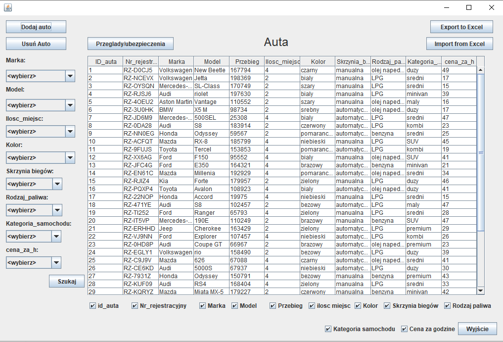
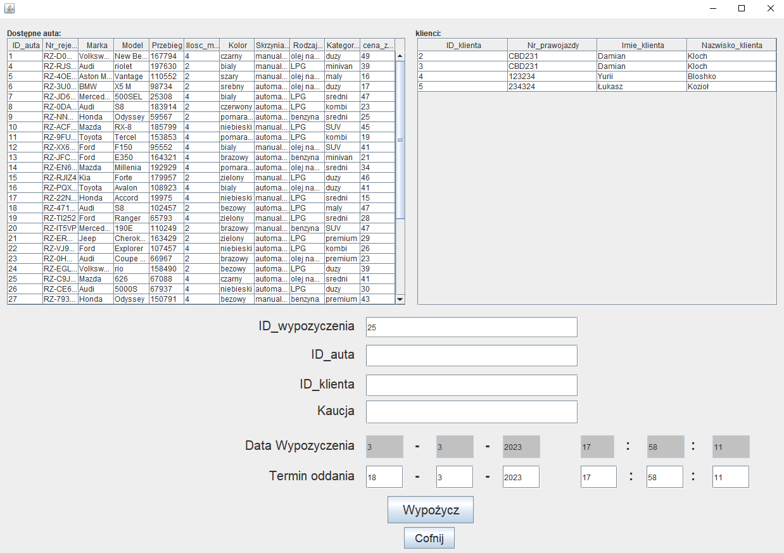
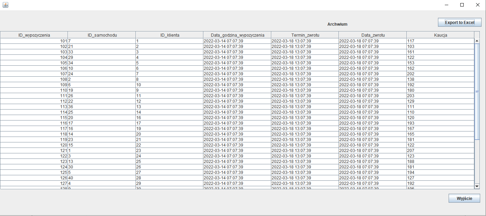
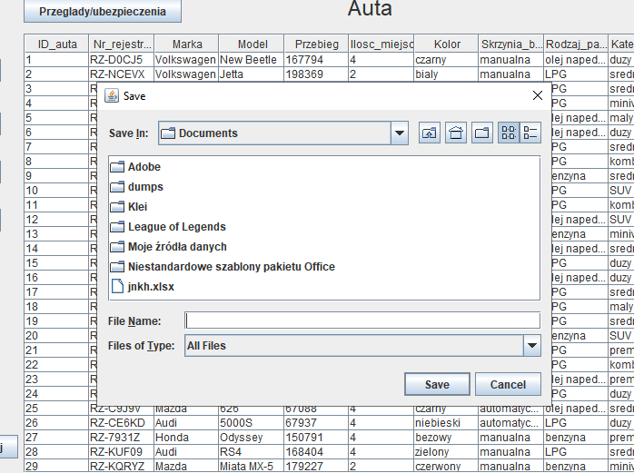
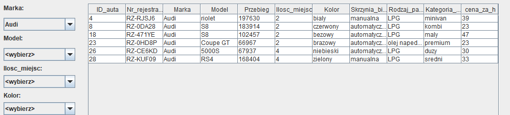

# Wypożyczalnia samochodów
## Cel projektu: stworzenie aplikacji wypożyczalni połączonej z bazą danych

 ## Funkcjonalności:
- Wypożyczanie auta i oddawanie
- Filtracja danych po atrybutach auta
- Eksport i import danych o autach z bazy i do bazy
- Dodawanie nowych klientów i ich usuwanie
- Archiwizacja danych

## Realizacja połączenia z bazą danych
- Baza danych łączy się z aplikacją przez klase DB przez myconnector-java-8.0.27

## Wykorzystane technologie

- Java
- Mysql

## Realizacja połączenia z bazą danych
- Baza danych łączy się z aplikacją przez klase DB przez myconnector-java-8.0.27 na porcie 3306

### Screenshots:

